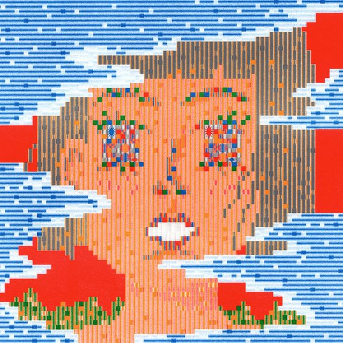
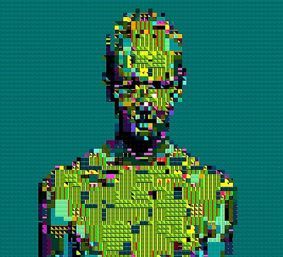
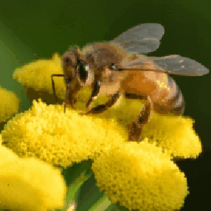

# week-8
### Part1: Imaging Technique Inspiration
#### These two photos inspired my final assignment and introduced me to pixel processing and image distortion techniques. These two images show a similar effect. By changing the position and color of individual pixels in the image, the visual effect is similar to a mosaic, and both images appear fragmented yet structured. I intend to use this technique to emphasize the randomness and chaos in the project and to reflect a compelling, playful visual style. Use pixel swapping and color averaging to achieve a similar effect.

### Part2: Coding Technique Exploration
#### The pixel swapper randomly arranges each pixel in the original image, creating a dynamic and chaotic visual effect. draw() loops through swapPixels() 100 times per frame, swapping the colors of random pixels to create a chaotic effect. averagePixels() can mix the rgb colors of two random pixels to form an average color, thereby creating smooth gradients in the image.

